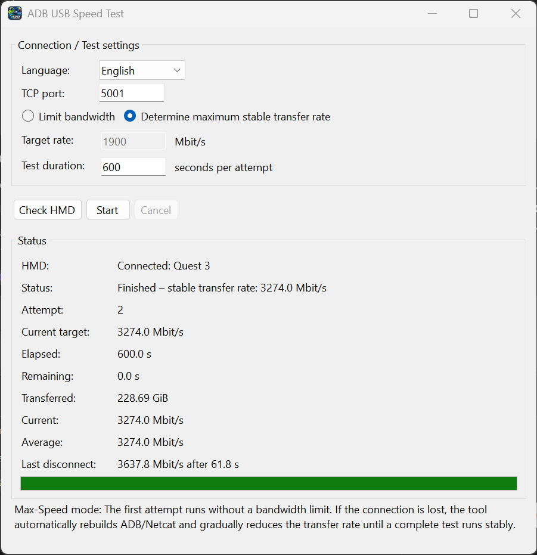

# ADB USB Speed Test

A native Windows GUI for testing ADB/USB transfer performance with Android devices and VR headsets.



## Features

- Native Windows x64 application built with .NET 8 WinForms
- No Python required
- Self-contained build — no separate .NET runtime required on the target PC
- German and English interface
- Persistent settings
- ADB device / HMD detection
- Configurable TCP port
- Fixed-bandwidth testing in Mbit/s
- Automatic maximum stable transfer-rate test
- Configurable test duration
- Live current and average throughput
- Transferred data counter
- Elapsed and remaining test time
- Progress indicator
- Automatic retry at a lower bandwidth if the connection drops
- Test cancellation
- Automatic ADB cleanup after tests, errors, cancellation and application exit
- Integrated application icon for Explorer, title bar, taskbar and Alt+Tab

## Maximum stable transfer rate

The recommended mode is:

**Determine maximum stable transfer rate**

The first attempt runs without a bandwidth limit.

If the ADB/USB connection drops during the test, ADB and the receiver connection are rebuilt automatically and the next attempt is performed at a reduced transfer rate.

This process continues until the configured test duration completes successfully or the retry limit is reached.

The application starts in this mode by default.

## Fixed bandwidth test

Select **Limit bandwidth** to test whether the connection remains stable at a specific transfer rate.

Enter the desired bandwidth in Mbit/s and choose the test duration.

## Default settings

- Test mode: **Determine maximum stable transfer rate**
- Test duration: **600 seconds**
- TCP port: **5001**

Settings are stored persistently and reused the next time the application is started.

## Requirements

- Windows 10/11 x64
- Android device or VR headset with USB debugging enabled
- Android SDK Platform Tools (ADB)

Python is **not** required.

The released application is built as a self-contained .NET 8 Windows application, so a separate .NET runtime installation is not required either.

## ADB / Android Platform Tools

ADB is not included with this project.

When the application starts, it checks for:

```text
adb\adb.exe
```

next to the application.

If ADB is not found, the application displays an ADB setup dialog.

You can then:

- **Download Platform Tools** — opens Google's official Android Platform Tools page.
- **Select ADB folder** — select an existing Platform Tools folder containing `adb.exe`.

The selected ADB location is saved and reused automatically on future starts.

Official Android SDK Platform Tools:

https://developer.android.com/tools/releases/platform-tools

### Optional local ADB layout

You can also place Platform Tools directly beside the application:

```text
ADB_USB_Speed_Test/
├── ADB_USB_Speed_Test.exe
└── adb/
    ├── adb.exe
    ├── AdbWinApi.dll
    └── AdbWinUsbApi.dll
```

The application detects this automatically.

## Usage

1. Enable USB debugging on the Android device or VR headset.
2. Connect it to the PC via USB.
3. Accept the USB-debugging authorization prompt on the device if required.
4. Start `ADB_USB_Speed_Test.exe`.
5. Configure ADB if prompted.
6. Click **Check HMD**.
7. Select the desired test mode.
8. Set the test duration and, for a limited test, the desired bandwidth.
9. Click **Start**.

During the test the application displays:

- current attempt
- current target bandwidth
- elapsed time
- remaining time
- transferred data
- current transfer rate
- average transfer rate
- last disconnect
- overall progress

The running test can be stopped with **Cancel**.

## How it works

The application uses ADB reverse port forwarding to expose a TCP listener on the Windows PC to the connected Android device.

Conceptually:

```text
PC TCP sender
      │
      │  localhost TCP
      ▼
 adb reverse
      │
      │  USB / ADB
      ▼
Android / VR headset
      │
      ▼
toybox nc
      │
      ▼
/dev/null
```

No test file needs to be written to the headset's storage.

The measured value therefore represents the throughput achieved by this ADB/TCP test path and should not be interpreted as the raw theoretical USB bus speed.

## Building from source

### Build requirements

Only the build PC requires:

- Windows x64
- .NET 8 SDK
- Optional: Android Platform Tools
- Optional: Inno Setup 6 for creating the installer

Run:

```text
BUILD_DOTNET8_PORTABLE.cmd
```

The project is published for:

```text
win-x64
self-contained
single-file
```

The resulting application can run on a Windows x64 PC without Python and without a separately installed .NET runtime.

ADB does not have to be bundled during the build. If it is absent, the application will ask the end user to download or select Platform Tools.

## Release downloads

For normal use, download the latest build from the GitHub **Releases** section.

ADB / Android Platform Tools are not included in these downloads.

## License

ADB USB Speed Test is released under the **GNU General Public License v3.0 (GPL-3.0)**.

Android Debug Bridge (ADB) and Android SDK Platform Tools are separate Google/Android components and are not part of this project's source-code license.

## Author

Created by [@urscaviezel](https://github.com/urscaviezel).
